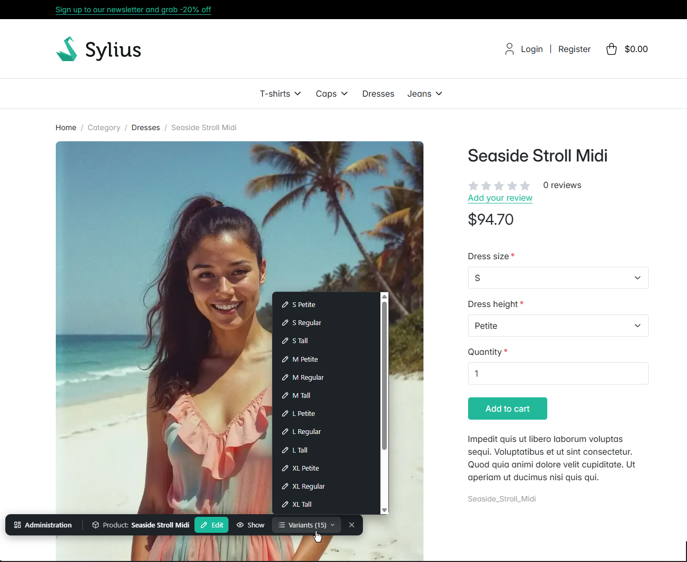
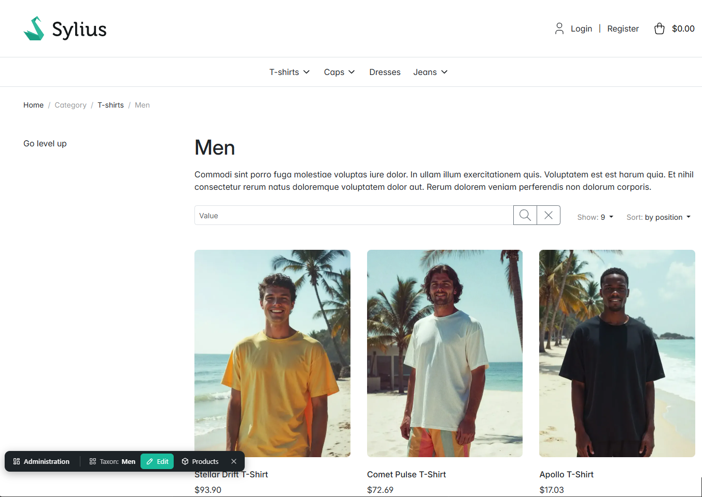
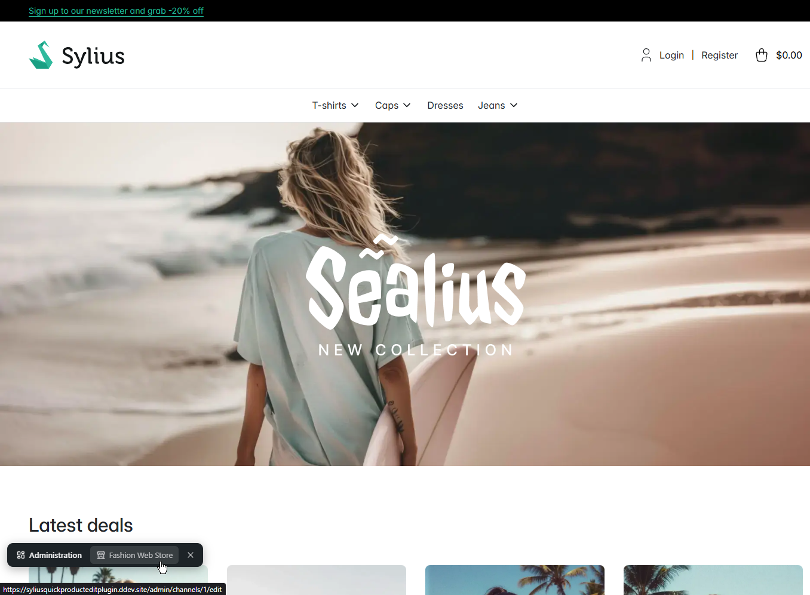
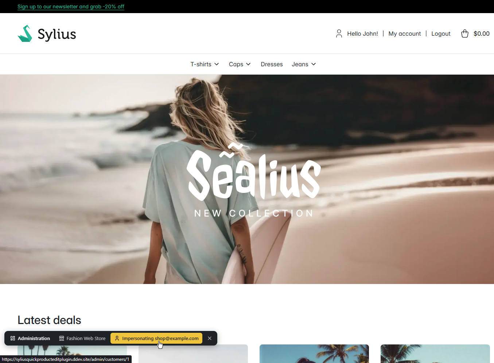

# Sylius Quick Edit Bar Plugin

Adds a floating bar to the storefront, similar to the Symfony web debug toolbar. It is visible only to visitors who are logged in to the Sylius admin and links straight into the admin: to the dashboard and the current channel on every page, and to the admin pages of the product or category you are looking at. While you impersonate a customer, the bar shows who you are logged in as.

The bar floats above the page at the bottom, so it never covers the shop header with its navigation and cart. The button on its right collapses it to a small button in the corner. This is remembered per browser until the bar is shown again.

## Demo

### Edit a product and list its variants



### Edit a taxon and list its products



### See and edit the current channel



### See which customer you are impersonating



## Requirements

- PHP 8.3 or higher
- Sylius 2.x on Symfony 7.4
- A storefront built with Webpack Encore and Stimulus (the Sylius 2 default)

## How it works

Sylius uses separate `admin` and `shop` firewalls, so a shop request doesn't know about the admin login. The plugin doesn't touch the security configuration. Instead, it works like this:

1. **Hint cookie:** while an administrator browses the admin, a non-HttpOnly cookie `s_krull_sylius_quick_edit_bar` is set. It holds only the path of the plugin's admin endpoint and is removed on admin logout.
2. **Storefront:** a hookable in `sylius_shop.base.header` adds an empty Stimulus controller with the code of the current channel to every shop page. Pages about a resource add a hidden marker: product pages and category pages. The shop HTML is the same for every visitor of a channel, so it stays cacheable and doesn't reveal the admin path. No shop template is overridden.
3. **Endpoint:** if the hint cookie is present, the Stimulus controller calls `GET /{admin}/quick-edit-bar?channel={code}&resource=product&id={id}`. The admin firewall protects this route (it also requires `ROLE_ADMINISTRATION_ACCESS`), and it returns the links for the bar. The bar appears only if the response is `200`.

Regular customers never send the request. Administrators whose session has expired get a redirect, so the bar stays hidden.

### Limitations

- Admin and shop must use the same host, because the admin session cookie has to be sent with the request. Channels served on different hostnames are not supported.
- Headless/API-only storefronts are not supported.

## Installation

1. Require the plugin (until the package is published on Packagist, add this repository as a [VCS repository](https://getcomposer.org/doc/05-repositories.md#vcs) first):

```bash
composer require skrull/sylius-quick-edit-bar-plugin
```

2. Register the bundle in `config/bundles.php`:

```php
SKrull\SyliusQuickEditBarPlugin\SKrullSyliusQuickEditBarPlugin::class => ['all' => true],
```

3. Import the configuration in `config/packages/s_krull_sylius_quick_edit_bar.yaml`:

```yaml
imports:
    - { resource: "@SKrullSyliusQuickEditBarPlugin/config/config.yaml" }
```

4. Import the admin routes **with the admin prefix** in `config/routes/s_krull_sylius_quick_edit_bar.yaml`:

```yaml
s_krull_sylius_quick_edit_bar_admin:
    resource: "@SKrullSyliusQuickEditBarPlugin/config/routes/admin.yaml"
    prefix: '/%sylius_admin.path_name%'
```

5. Register the Stimulus controller. Add the package to your `package.json`:

```json
"@skrull/sylius-quick-edit-bar-plugin": "file:vendor/skrull/sylius-quick-edit-bar-plugin/assets"
```

Enable it in `assets/shop/controllers.json`:

```json
"@skrull/sylius-quick-edit-bar-plugin": {
    "quick-edit-bar": {
        "enabled": true,
        "fetch": "lazy"
    }
}
```

Then rebuild the assets: `yarn install && yarn build`. After updating the plugin, run `yarn install --force` first, because Yarn copies the package instead of linking it.

## Supported pages

The bar links to the Sylius admin pages of these shop pages:

| Shop page                                                            | Links                                        |
|----------------------------------------------------------------------|----------------------------------------------|
| Product page (`sylius_shop.product.show`)                            | Edit, Show, Variants (configurable products) |
| Category page (`sylius_shop.product.index.content.body.main.header`) | Edit, Products                               |

The variants dropdown lists up to 20 variants (see [Configuration](#configuration)) and links to the full list.

On every shop page the bar also shows:

- **Dashboard:** link to the admin dashboard.
- **Channel:** name of the current channel, linking to its edit page.
- **Impersonation:** while you impersonate a customer from the admin (the *Impersonate* button on the customer page), the bar shows *Impersonating customer@example.com* in yellow, linking to the customer. It is detected from the session that admin and shop share, so nothing about the customer is added to the shop HTML, and customers who log in themselves are never shown. It disappears when you log out in the shop.

## Configuration

All options with their defaults, e.g. in `config/packages/s_krull_sylius_quick_edit_bar.yaml`:

```yaml
s_krull_sylius_quick_edit_bar:
    # Edge of the viewport the bar floats at: bottom or top
    position: bottom

    product:
        # Number of variants listed in the variants dropdown (at least 1), the last entry always links to the full list
        max_variants: 20
```

Like any bundle configuration, the value can differ per environment or come from an environment variable:

```yaml
s_krull_sylius_quick_edit_bar:
    product:
        max_variants: '%env(int:QUICK_EDIT_BAR_MAX_VARIANTS)%'

when@dev:
    s_krull_sylius_quick_edit_bar:
        product:
            max_variants: 100
```

To check the configuration that is actually used:

```bash
bin/console debug:config s_krull_sylius_quick_edit_bar
```

To inspect the response of the bar, open the endpoint directly while logged in to the admin, e.g. `/admin/quick-edit-bar?resource=product&id=1`.

## Tests

Run the unit tests (no database required):

```bash
composer test
```

Run the functional tests (requires a configured test database, see `tests/TestApplication/.env.test`):

```bash
vendor/bin/phpunit --testsuite functional
```

The remaining CI checks:

```bash
composer analyze        # PHPStan
composer cs-check       # Easy Coding Standard
composer cs-twig        # Twig CS Fixer
composer check-license  # Licenses of all dependencies
```

## Contribution
Feel free to contribute to this module by reporting issues or create some pull requests for improvements.

To run the Test Application included in the repo, refer to the [Sylius Test Application](https://docs.sylius.com/plugins-development-guide/test-application) docs.
If you are using [DDEV](https://www.ddev.com) you can run the following commands to bootstrap the Test Application in Docker:

```bash
ddev start
```

```bash
ddev bootstrap
```

## License
The **Sylius Quick Edit Bar Plugin** for *Sylius* is released under the MIT license. See [LICENSE.md](LICENSE.md).
